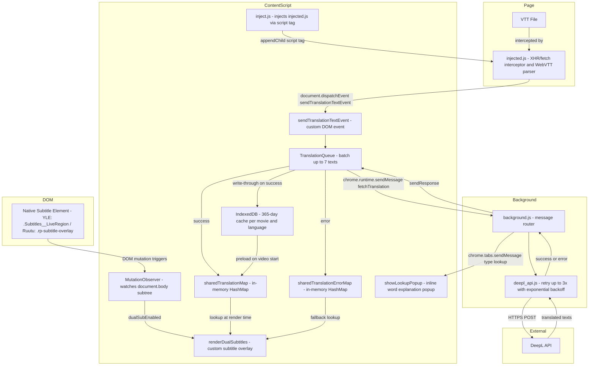
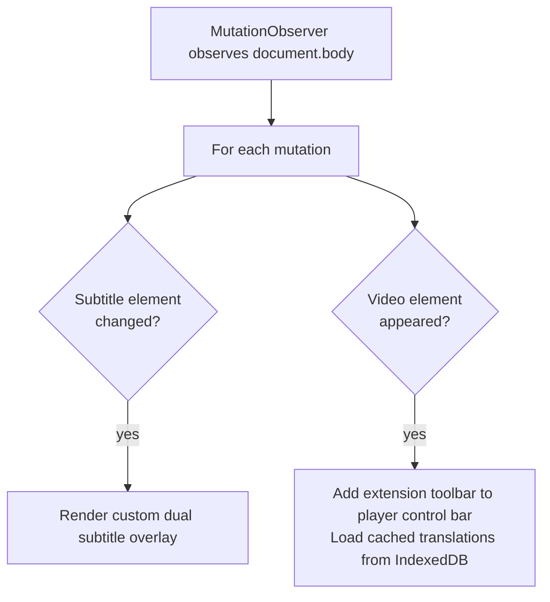

# Learn Finnish - Dual Subtitles for Finnish Streaming

A Chrome extension that adds dual subtitles to YLE Areena and Ruutu.fi videos, helping you learn Finnish through immersion by displaying Finnish subtitles alongside translations in your preferred language.

Check [project video demo](https://www.youtube.com/watch?v=O3B7BCvd99Y)

## What It Does

This extension integrates with YLE Areena and Ruutu.fi video players to show dual subtitles — Finnish on top, your chosen translation below. As you watch Finnish TV shows, movies, and documentaries, you can follow along in both languages simultaneously.

## Key Features

- **Dual Subtitle Display** — Finnish + translated subtitles shown simultaneously
- **Multiple Language Support** — Translate to English, Vietnamese, Japanese, Spanish, or any of 30+ languages supported by DeepL
- **Smart Caching** — Translations stored locally for 365 days; rewatching videos uses zero API calls
- **Multi-Token Support** — Add multiple DeepL API tokens with visual usage tracking
- **One-Click Toggle** — Enable/disable dual subtitles directly in the video player
- **Blur Mode** — Hide Finnish, translation, or both subtitles to test yourself — hover to reveal
- **Shadowing Tools** — Rewind/forward 3-second buttons + keyboard shortcuts (`,` and `.` keys) for pronunciation practice
- **Word Lookup** — Select any word in a subtitle and right-click for an instant in-page translation without leaving the video
- **Copy Subtitle** — Click the copy icon to send the current Finnish subtitle line to your clipboard
- **Reload Subtitles** — Clear cached translations for the current episode and re-translate from scratch
- **Privacy-First** — All data stays in your browser; no tracking, no ads

## Why I Built This

I've passed the YKI test (all 4 skills) and completed Suomen Mestari 4. But until then, my skill is far from enough to hold a deep and meaningful conversation in Finnish. That is because, the spoken language, with many slangs and its own rules, is different from what we learned in the grammar books. Finnish people speak perfect English so it is not easy to practice in the real life, plus that my level is not enough to discuss complicated topics.

This extension is my plan to reach the next level, where you can expose to authentic spoken Finnish in a safe environment, where you don't have pressure to speak. You have access to all contents in YLE Areena and Ruutu.fi to immerse not only in the language, but also in the culture and history. You can even use it to watch news and president speeches regardless of your Finnish level.

## How It Works

1. You watch videos on YLE Areena or Ruutu.fi with Finnish subtitles enabled
2. The extension intercepts Finnish subtitle text
3. Text is translated via DeepL API using your personal API key
4. Translations are cached locally in IndexedDB for 365 days
5. Both Finnish and translated subtitles display in the video player

## Architecture



### MutationObserver Flow



## Installation

Install from the [Chrome Web Store](https://chromewebstore.google.com/detail/yle-areena-dual-subtitles/olmapcjpickcoabnjleheppoignffpdd)

See the [documentation site](https://finnish-streaming-dual-sub.netlify.app/) for setup instructions and usage guide.

## Technology Stack

- **Manifest V3** Chrome Extension
- **DeepL API** for high-quality translations
- **IndexedDB** for local caching with multi-language support
- **Chrome Storage Sync** for cross-device settings persistence
- **React** for the settings UI (options page)

## Project Structure

```
main/                           # Core extension logic
├── types.js                    # Shared JSDoc type definitions
├── translation/
│   ├── deepl_api.js            # DeepL translation API calls
├── background/
│   ├── background.js           # Service worker: handles translation requests, context menus
│   ├── inject.js               # Content script: injects injected.js into the page
│   └── injected.js             # Injected page script: XHR interceptor for VTT subtitle parsing
├── utils/
│   ├── database.js             # IndexedDB wrapper for translation caching
│   └── utils.js                # Shared utilities: token loading, translation dispatch
└── platform/                   # Platform-specific implementations
    ├── yle/
    │   ├── contentscript.js    # YLE Areena: MutationObserver-based subtitle detection
    │   └── styles.css
    └── ruutu/
        ├── contentscript_ruutu.js  # Ruutu: TextTrack API-based subtitle detection
        └── styles_ruutu.css

extension-popup/                # Toolbar popup (HTML + vanilla JS)
extension-options-page/         # Settings page (Vite + React)
tests/                          # Jest test suite
```

The two platform implementations are intentionally different:
- **YLE Areena** uses a `MutationObserver` because subtitles are rendered in the DOM
- **Ruutu** uses the `TextTrack` API because HLS streams don't expose subtitles in the DOM

## Contributing

Contributions are welcome! The scope of this project is dual subtitle support for Finnish streaming services — currently YLE Areena and Ruutu.fi. Source subtitle language can be Finnish or Swedish, matching the content available on those platforms.

Check the [open issues](https://github.com/anhtumai/finnish-streaming-dual-sub/issues) for things to work on. Good starting points for new contributors:

- **Add a new Finnish/Swedish streaming platform** — The architecture is designed for this. Add a new folder under `main/platform/`, implement subtitle detection (either DOM `MutationObserver` or a page-level interceptor like Ruutu), and register it in `manifest.json`. Follow `contentscript_ruutu.js` as a template. For example, adding `MTV Katsomo` as another platform.

## Development

```bash
# Install dependencies
npm install

# Run linting
npm run lint

# Run type checking (checks all tsconfig references)
npm run type-check

# Run tests
npm test

# Run all checks
npm run validate

# Build settings page
cd extension-options-page && npm install && npm run build
```

Load the unpacked extension in Chrome from the project root — no build step needed for the extension itself.

## License

GPL v3 (GNU General Public License v3)
